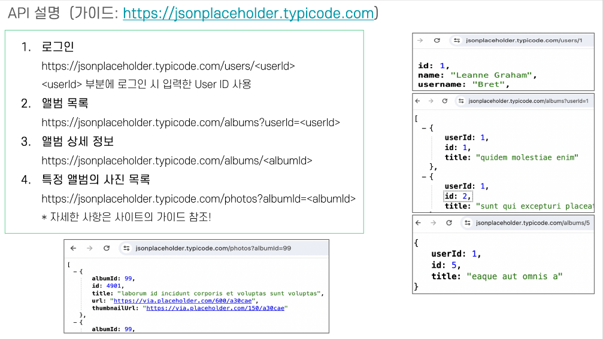

# Digital Hanaro FE Assignment

## 요구사항

## 구현 중점 사항

1. 컴포넌트 구현
    Layout 구성을 기반으로
    Fixed-Top 인 Header와, 내용을 담을 MainCard 컴포넌트로 분리하여 구현
    이후 해당 컴포넌트를 사용하여 각 PageView를 위한 Login / Album / AlbumDetail 과 404 Page구현

2. Provider (Context,Reducer) 구현
    컴포넌트 간 값 교환을 위해 UserReducer와 AlbumReducer구현.
    각각의 정보를 새로고침 시에도 잃어버리지 않게 하기 위해 LocalStorage에도 저장.
    새로 고침 시 Reducer 정보가 날라가는데, 이 때 LocalStorage에 해당 값이 존재하면 값을 받아오는 방식으로 구현

3. 예외 처리
    요구사항에 정해준 ValidId값 1~10 이외 값 입력 시 경고 및 제출 시도 시 하이라이트 적용
    로그인 정보가 없는 사용자가 URL을 통해 Album / AlbumDetail 에 접근 시 로그인 페이지로 Navigate
    선택 앨범 정보가 없는 사용자가 URL을 통해 AlbumDetail에 접근 시 Album 페이지로 Navigate

## How to run

    npm instaill
    npm start
